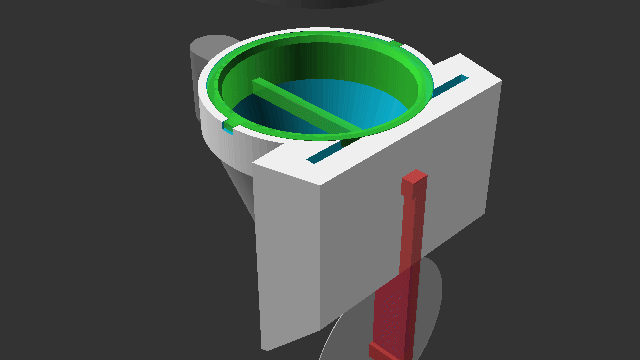

# Aeropress Desk Cleaning Funnel (ADCF)

A 3D-printable, support-free, modular tool to clean your Aeropress plunger and metal filter directly at your office desk without needing a sink or running water.

## How It Works
*   **Plunger Cleaning**: Push the plunger down into the top chamber of the funnel. A flexible ring squeegees the cylindrical outer walls of the rubber seal, while a contoured blade sweeps the grounds off the convex face. Give it a twist, and the grounds fall straight down into the trash.
*   **Metal Filter Cleaning**: Slide the metal filter disc horizontally through the side slot. Two overlapping flexible scraper lips wipe the grounds off both sides simultaneously, dropping them down the funnel.

---

## 3D Printing & Materials Guide

This model is designed to be **printed completely without supports** when printed in the recommended orientations.

| Part | Material | Print Orientation | Qty | Notes |
| :--- | :--- | :--- | :---: | :--- |
| **Funnel Body** | PETG / PLA | Upright (Spout on bed) | 1 | Tapered walls and bridging handles require no support. |
| **Plunger Insert** | Flexible PLA / TPU | Flat (Bottom face on bed) | 1 | Snaps into the top funnel chamber (uses alignment tabs). |
| **Filter Insert Half** | Flexible PLA / TPU | Flat (Mating face on bed) | 2 | Slide both halves into the side pocket. Flipped mating lips create the scraper slot. |

### Settings:
*   **Rigid parts**: 0.2mm layer height, 3 walls, 15-20% infill.
*   **Flexible parts**: 0.2mm layer height, 2-3 walls, 15% infill.

---

## Assembly
1.  Print all parts.
2.  Slide the **Plunger Insert** into the top opening of the **Funnel Body**, aligning the two rectangular tabs with the keyway slots in the funnel rim. Push it down until it sits flat on the shoulder.
3.  Take both **Filter Insert Halves**. Slide them one by one into the vertical pocket on the side of the funnel. They should stack together, with the middle scraping lips meeting in the center of the slot.
4.  Hold the funnel by the handle over a trash can and clean your Aeropress mess-free!

---

## OpenSCAD Customization
The model is fully parametric. You can customize the dimensions (such as plunger diameter, dome depth, filter diameter, and print clearances) by editing the variables at the top of `aeropress_cleaner.scad` in OpenSCAD Customizer:

*   `plunger_di` (default `57.2` mm) — Standard internal brew chamber diameter (referenced from [AeroPress Chamber Dimensions on Reddit](https://www.reddit.com/r/AeroPress/comments/f4i7v8/chamber_dimensions/)).
*   `plunger_dome_h` (default `3.5` mm) — Curve depth of the rubber plunger seal.
*   `filter_di` (default `62.0` mm) — Standard reusable stainless steel filter diameter (referenced from [Official AeroPress Reusable Metal Filter specifications](https://aeropress.com/products/aeropress-reusable-metal-filter)).
*   `clearance` (default `0.2` mm)
*   `wall_thickness` (default `2.4` mm)
*   `flex_wall` (default `2.0` mm)
