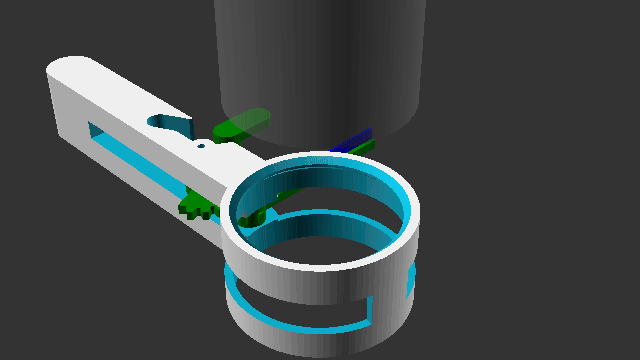
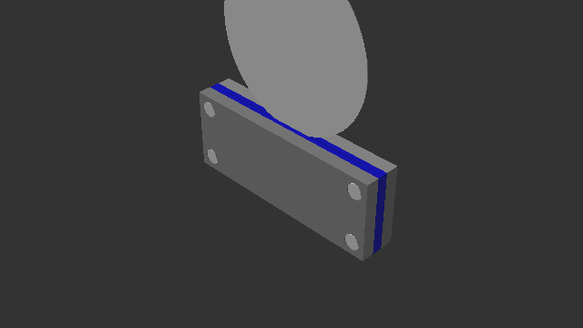

# Aeropress Cleaners (ADCR & AMFC)

This repository contains two 3D-printable, office-desk-friendly cleaning tools for the **AeroPress** coffee maker, designed to clean coffee grounds directly over a trash can:
1.  **Plunger Wiper Ring (ADCR)**: Sweeps coffee grounds off the rubber plunger seal face using a spring-returned pivoted squeegee.
2.  **Metal Filter Cleaner (AMFC)**: Wipes grounds off both sides of a circular metal mesh filter using a clamped double-sided squeegee envelope.

Both tools are designed to print completely **support-free** and assemble using standard Prusa-style **M3 metal screws** and a **harvested Mounjaro pen spring**.

---

## 1. Plunger Wiper Ring (ADCR)

### How It Works:
*   Slide the ring collar over the Aeropress plunger seal until it sits flush against the internal stop ledge.
*   Push the thumb lever to compress the spring and sweep the flexible blade across the plunger face.
*   Release the lever. The vertical Mounjaro pen spring pops the arm back to the park position.
*   Coffee grounds fall out the open bottom of the ring.

### Bill of Materials & Print Guide:
*   **M3x12mm Screw** (x1): Functions as the metal hinge pivot shaft. Threads directly into the top knuckle plastic.
*   **Mounjaro Pen Spring** (x1): Harvested from a spent injection pen (approx. 8mm OD, 40mm length).
*   **ring.stl** (Rigid): Print **upside-down (top rim on bed)**, no supports.
*   **wiper.stl** (Rigid): Print flat on bed.
*   **blade.stl** (Flexible TPU): Print flat on bed.

---

## 2. Metal Filter Cleaner (AMFC)

### How It Works:
*   Hold the filter cleaner vertically over a trash can.
*   Push your circular metal mesh filter ($62\text{mm}$) down into the top chamfered funnel guide.
*   Slide the filter all the way through the channel. Dual TPU squeegee blades scrape both faces of the filter at the same time.
*   Cleaned filter slides out the bottom, while grounds fall straight down into the trash.

### Bill of Materials & Print Guide:
*   **M3x12mm Screws** (x4): Securely clamp the front and back halves together.
*   **filter_front.stl** (Rigid): Contains M3 clearance screw holes. Print flat, mating face on bed.
*   **filter_back.stl** (Rigid): Contains M3 tap holes. Print flat, mating face on bed.
*   **filter_blade.stl** (Flexible TPU, x2): Print flat. Simple rectangular squeegee sheets ($55\text{mm} \times 15\text{mm} \times 1.5\text{mm}$).

---

## Assembly Instructions

### Plunger Ring:
1.  Insert the flexible **blade** into the slot on the **wiper** arm (starts 8mm from pivot).
2.  Press-fit the Mounjaro pen spring onto the stationary **Ring Post peg** and the moving **Lever Post peg**.
3.  Align the wiper knuckle with the ring knuckles and insert your **M3x12mm screw** from the bottom. Tighten until the head is flush inside the bottom recess.

### Filter Cleaner:
1.  Place the two flat TPU **filter_blade** sheets into the recesses of the **filter_front** and **filter_back** halves.
2.  Press the front and back halves together (alignment tracks will match).
3.  Insert **four M3x12mm screws** from the front clearance side and screw them securely into the back tap holes to clamp the blades flat.

---

## Customization in OpenSCAD
Each project has its own parametric model:
*   `aeropress_cleaner.scad`: Customizable plunger diameters (`plunger_di`), wall thickness, and M3 clearance fits.
*   `filter_cleaner.scad`: Customizable filter diameters (`filter_di`), filter thickness, and blade clearances.
